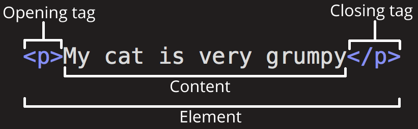
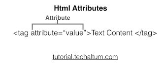

# Level 1
1. IDEorCodeEditor

1. WhatisIDE
2. NeedofIDE
3. IDESelection
4. InstallationandSetup 
5. VsCodeExtensions

2. WebsiteComponentsandFundamentals

1. ClientSidevsServerSide
2. FrontEnd/BackEnd/FullStack 
3. RoleofBrowser
4. HTML
5. CSS
6. JS

# 2. Basic of HTML

## 2.1 What are tag

1. Elements that area used to create a website are called HTML tags.
   2.Tag can contain contain or other HTMLtags
   3.Dfine elements line like text ,images ,link

## 2.3 Basic HTMl Page

<!DOCTYPE html>                 Define the HTML version
<html lang="en">                parent of all HTML tags / Root element
<head>                              Parent of meta data
    
    <title>My First Webpage</title>         Title ofthe web pages
</head>
<body>                                      Parent of content tags
    <h1>  Hello world !</h1>                Heading tag
</body>
</html>

## 2.4 MDN Documention

## 2.5 Comments

syntax :- <!-- comment here -->

## 2.6 Case Sensitivity

1. HTML is case-insensitivity for tag names
2. attribute name are also casse-insensitive
3. Best practice: use lowercase for consistency

-----------------------------------------------------------

# LEVEL 2 MUST -USE HTML TAG

## 1. HTML Attributes
1. What are HTML Attributes
2. Id Property

## 2. HTML Tags
1. Heading Tag
2. Paragraph Tag
3. '  
' tags
4. Image Tag
5. Video Tag
6. Anchor Tag
7. Bold / Italic / Underline / Strikethrough
8. Pre Tag
9. Big / Small Tag
10. Superscript / Subscript

## 3. Character Entity Reference
1. What are Character Entity References

### 1.1 what are HTML attributes?

<tag attribute="value">Text Content </tag>

1. provide additional information about elements
2. Placed within opening tags
3. Common examples: href,src,alt
4. Use name=value format
5. Can be single or multiple per element

### 1.2 id property

● Unique Identifier: Each id should be unique within a page.

● Anchoring: Allows for direct links to sections using the #id syntax in URLs.

● CSS & JavaScript: Used for selecting elements for styling or scripting.

## 2.1 Heading Tag

1. Define heading in a document
2. Ranges from <h1> to <h6>
3. <h1> is most important, <h6> is least
4. Helps is structuring content

### 2.2 paragraph Tag

1.used for defining paragraph
2.Enclosed within 
 and 
 tags
3. Adds automatic spacing before and after
4. Text wraps to next line inside tag
5. common in text -heavy content 

2.3   tag

1.   add a line break within text
2.   is empty , no closing tag needed
3.   and   are both valid

2.3 
 tag 
1. 
 creates a horizontal rule or line 
2. 
 also empty, acts as a divider

### 2.4 Image Tag

1. used to embed images
2. Utilizes the src attribute for image url
3. alt attribute for alternative text
4. can be resized using width and height 
5. Self- closing, does not require an end tag

### 2.5 video Tag

1. Embeds video files ona page
2. uses src attribute for video URL
3. support multiple formats like MP4, WebM
4. Allows for built-in controls via attributes like autoplay ,controls,loop

 ### 2.6 Anchor tag

1. Used for creating hyperliks
2. Reqired href attribute for URL
3. Can link to external sites or internal pages
4. Supports target attribute to control link behavior
git 

## 2.7 bold/Italic/Underline /strikethrough

1. <b> makes text bold
2. <i> makes text italic
3. <u> underlines text
4. <s> or <strike> applies strikethrough
5. Primarily used for text styling and emphasis

## 2.8 pre Tag

1. preserves text formatting
2. Maintain whitespaces and line breaks
3. useful for diplaying code 
4. Enclosed within <pre> and </pre> tags

## 2.9 Big / Small tag

1. <big> increases text size
2. <small> decreses text size 
3. Less common due to CSS alternatives

## 2.10 Superscript / subscript tag
 1.  makes text superscript
 2.  make text subscript
 3. used for mathematical equations , foot notes
 4. Does not change font size

## 3. CHaracter Entity Reference

1. used to display reserved oe special character
2. Syntax often  with & and ends with ; (eg :- &amp: for &)

------------------------------------------------------------------------------

#  LEVEL 3  BROWSER TOLS

## 1. BrowserTools
1. ViewPageSource 
2. InspectElement
3. HTMLwithoutCSS

## 2. ResponsiveDesign

1. Differentscreensize

## 3. LiveEditCode
1. LiveeditHTML
2. LiveeditCSS
3. LiveeditJS
4. Changesonlyhappeningatclient

## 4. ValidatingWebpages
1. Usingvalidator.w3.org

## 1. BrowserTools

 ## 1.1  View Page Source   

 1. Diplay raw html CSS 
 2. usefull for debugging and learning
 3. shows external file like javascript links

 ## 1.2  Inspect Element

1. Allow real-time of HTML/CSS
2. Usefull for debugging and testing
3. Show element hierarchy and layout
4. Inckudes console for javascript
5. Highlight selected elements on page

 ## 1.3 HTML without CSS
  

## 2. Responsive Design

 ## 2.1 Differentscreensize
 
 1. Adapts layout for different Screen sizes
 2. Flexiable layouts
 3. Optimizes images and assets
 4. Enhances user experience on moblie and desktop

## 3. LiveEditCode

## 3.1 Live edit HTML
  1.changed subcriber count

## 3.2 Live edit CSS'
 1.changed channel Name colour

## 3.3 LiveeditJS

## 4.3Changes only happening at client
1. changes made are temporary
2. Affect only the current session 
3. Not saved to the server
4. Reset upon page reload 
5. Useful for testing, not permanent fixes

## 4. Validating Webpages
1. Ensures HTML adheres to standards
2. Minimizes cross- broser issues 
3. Helps in achieving better SEO results
4. Easier to debug and 
5. Optimizes performaces reducing parsing 

---------------------------------------------------------

# LEVEL 4 HTML and project Structure

## 1. Semantic Tags
 1. Semantic / Non-Semantic Tags

## 2. Body Tags
1. Header Tag
2. Main Tag
    1. Section Tag
    2. Article Tag
    3. Aside Tag

3. Footer Tag

## 3. Folder Structure
1. Recommended Folder structure

## 4. More Tags
 1. Navigation tags
 2. Block / Inline Elements
 3. Div tags
 4. Span Tags

 ## 1. Semantic Tags
 ## 1.1 Semantic / Non-Semantic Tags

         Semantic tag                                |      Non semantic Tags
 ----------------------------------------------------|-------------------------------------        
1.Meaningful : Describe content.                     |   1. Generic : No specicic meaning
2.SEO : Good for search engines.                     |   2. NO SEO : Not SEO-friendly
3.Accessibility : Useful for screeen resaders.       |   3. For Styling : Used for layout
4.Example : <header>, <footer>, <article>, <nav>     |   4. Examples: 
, <i>,<b>,
<section >.                                          |
                                                     |

## 2. Body Tags

## 2.1 Header Tag
1. purpose : Used to contain introductory content or navigation links.
2. Semantic :- It's a semantic tags. providing meaning to the enclosed contain
3. Location: Commonly found at the top web pages, but can also appers within  <article>, or <section>tags.
4. Multiple Instances : Can be used more than once on a pages  within different  section 

## 2.2 Main Tag

1.purpose: Encloser the primary of a webpages.
2.Semantic : Adds eaning, indicating the main content area.
3.unique: Should appear only onces per page.
3.Accessibility : Helps screen readers indentify key content.
4.Not for Sidebars: Excludes content repeated across multiple pages like side
navigation or footer.
    
    
## 2.2.1 Section Tag
1. purpose : Groups related content in a distinct  section
2. Semantic : Adds structure and  meaning 
3. Headers: Often used with  a heading <h1> to <h6> to indication
4. Nested : Can be nested within other <section> or <article> tags

## 2.2.2 Article Tag
1. Encloses content that stands alone , like  a blog post or new
2. Semantic : provides contextual meaning
3. independence : Content should make sense even if taken out of th page context
4. Multiple Instances : can be used multiple times on the same pages

## 2.2.3  Aside Tag
1. purpose: contain sidebar or supplementary content
2. Semantic : indicates content tangentially related to main content 
3. Not crucial : content is not essential to understanding the main content
4. Examples : Could hold widgets, quotes , or ads.

## 2.3 Footer Tag
1. Purpose : for footer content like extrainfo or link.
2. Semantic: provides meaning to enclosed content.
3. Location : Typing at the vootom of pages or section.
4. Content : includes copyright , contact info  and  social links 
5. Multiple instances : can be used more than onces on a pages

## 2.3 Folder Structure

## 2.3.1  Recommended Folder structure
1. Root Directory :- main folder containing all wedsites files.
2. HTML files : Store main .html files at the root level for easy access.
3. CSS Folder : create a css / folder for  cascading style sheets.
4. JS Folder : use a scripts / folder for JavaScript files.
5. images folder : Store images in an images/ or images/
folder.
6. assest : other  like fonts can go in  assets /folder
7. Sub- directories : for multi- page  websites , uses folder to categorize content.d

## 4 More Tags

 ## 4.1 Navigation tags

 1. purpose : Enclose navigation links or menus
 2. Semantic : signals  that the content meant for navigating the site 
 3. Common content : Usually contain lists <ul>,<ol> for links <a>
 4. Accessibility : aids screen readers in indentifying site navigation.

 ## 4.2 Block / Inline Elements
 Block Elements 
 1. New linw : start on new line.
 2. Full width : Take up all horizontal
 3. Stylin:  Can have Margins and  padding
 4. size : width and height can be set
 5. Examples : 
, 
,<h1>,<ul>,<li>

Inline Elements
1. Flow : Stay in line with text.
2. width : just as wide as the content
3. No Break : No New Line Between Elements
4. Limited styling : Cant'
5. Examples : <spam>,<a>,<strong>,<em>,.

 ## 4.3 Div tags

 1. purpose : acts as a container for other HTML elements.
 2. Non - semantic : Does't provide interent meaning to enclose content
 3. Styling : commonly used for layout and styling via CSS
 4. Flexibility : highly versatile and can be customized using classes

 ## 4.4 Span Tags
 1. Purpose :used for inline elements ti style or manipulate a portion of text
 2. non-Semantic : Does't add  specific meaning to the enclose text
 3. Stying : commonly used for changing color ,font, or adding effects
 4. Inline Nature : Doesn't break text flow or create a new block- level

----------------------------------------------------------------------------------
# LEVEL 5 List ,Tables & Forms

## 1. List Tag
1. Ordered Lists
2. Types of Ordered Lists
3. Unordered Lists

## 2. Table Tag
1. <tr>, <td>, <th> tags
2. Captions
3. Col spans

## 3. Forms
1. Input tag
2. Action Attributes
3. Name and Value Property
4. Label Tag
5. Exploring Types

## 4. iFrame Tag
 1. Using iFrames

 ## 1. List Tag
1.1 Ordered Lists
1. Purpose : used for creating lists with items that have a specific  order
2. Default : iteams are automatically numbered.
3. Nesting : Can be nested within other lists

1.2 Types of Ordered Lists

Oresered Lists
A. Numeric: default type, (1,2,3,....)
   Attribute : type = "1"
B. Upper Letter : (A,B,C....)
    Attribute :type ="A"
c. Lowercase Letter: (a,b,c,..)
    Attribute : type = "a"
D. Uppercase Roman :(I,II,III,...)
    attribute :type = "I"
E. Lowercase Roman : (i,ii,iii...)
    Attributes : type = " i"

1.3. Unordered Lists
1. Used for lis where the order of items doesn't matter
2. Default : Items sre usually bulleted.
3. Nesting : Can be Nested within other lists.

## 2. Table Tag
1. <tr>, <td>, <th> tags
a. <tr> Table Row : Used to define a row in an HTML table 
b. <th> Table Header : used for header cells within a row .
    Text is bold and centered by default.
c. <id> Table Data : This holds the actual data

2. Captions
a. Purpose : Provide a title or description for a table 
b. Placement :Must be inserted immediately after the <table> opening
c. Alignment : Centered above the  table by default
d.Accessibility : Helps screen readers understand the tabl's

3. Col spans
a. Attributes : Uses the colspan attributes in <td> or <th> tags
b. purpose : Must be inserted immediately after the <table> opening
c. Alignment : Takes the space of the specified number of columns
d. Layout : useful combining cells create complex table layouts.

## 3. Forms
 ## 3.1 Input tag

a. Purpose : Used within a <form> element to collect user input
b. Self-closing : The <input> tag is self -closing ; doesn't require a closing tag.
c. Attributes : Common attributes are name, value placeholder,and required

2. Action Attributes
3. Name and Value Property
4. Label Tag
5. Exploring Types

## 4. iFrame Tag
 1. Using iFrames 